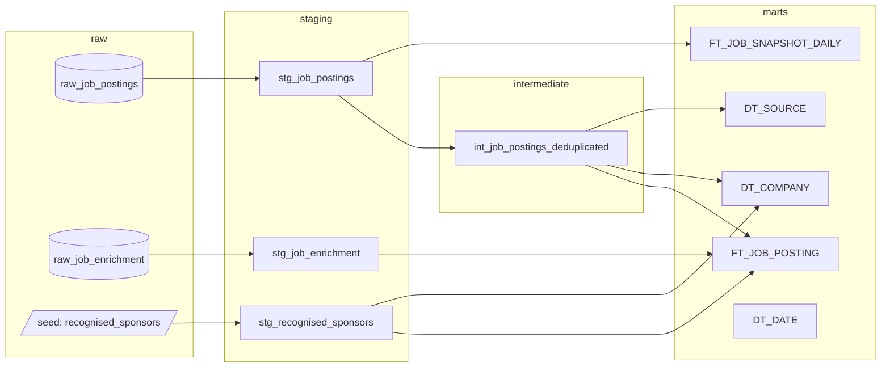

# Job Market Intelligence Engine

[](https://github.com/carlosdmv7/job-market-intelligence/actions/workflows/ci.yml)
[](https://github.com/carlosdmv7/job-market-intelligence/actions/workflows/pipeline.yml)

An end-to-end **data-engineering + analytics-engineering + LLM** project that
ingests EU tech jobs daily, enriches them with an LLM, models them dimensionally
with dbt, and serves the result through a Streamlit app — including a
guard-railed natural-language **"Ask the Data"** agent.

**Live app:** [job-market-intelligence-carlosdmv7.streamlit.app](https://job-market-intelligence-carlosdmv7.streamlit.app/) · **Runs at 0€** end to end (MotherDuck free tier,
Gemini/Ollama, free job APIs, GitHub Actions as the scheduler — see
[ADR 0005](docs/adr/0005-zero-cost-stack.md)).

## The differentiating feature: auditable visa-sponsorship detection

Most "AI job board" projects ask an LLM whether a posting sponsors visas and
stop there. This project treats the LLM as the *weakest* of two signals:

1. **Deterministic (primary):** every posting's company is cross-referenced
   against the official **IND register of recognised sponsors** — the ~12,800
   Dutch employers legally allowed to sponsor a highly-skilled-migrant visa
   ([scraper](scrapers/jmi_scrapers/ind_sponsors.py) → dbt seed →
   [normalized join](dbt/jmi/macros/jmi_normalize_company.sql) applied
   identically to both sides). A match is **auditable**: it carries the
   company's KvK (Chamber of Commerce) number, so every flag can be verified
   against a public register. No hallucinations possible.
2. **LLM (secondary):** the posting *text* is classified into a visa enum with
   confidence + verbatim evidence ([ADR 0003](docs/adr/0003-visa-enum-classification.md)).

Why it matters, measured on this corpus: on remote-first job boards only
**~1%** of companies are recognised sponsors; on the NL-local corpus (Adzuna)
it is **~34%** — the deterministic signal is what makes the tool actually
useful for relocation, and it works even for postings the LLM never saw.

## Architecture

```
free APIs + Adzuna NL/DE/ES + JobTech SE ──httpx──► ingest ─► raw.raw_job_postings (append-only)
IND sponsor register ──scraper──► dbt seed         raw.raw_job_enrichment  (LLM output)
                                        │
                    MotherDuck + dbt medallion: staging → intermediate → marts
                                        │
                    Streamlit: Visa Sponsorship · Trends · Ask the Data (text-to-SQL)
```

dbt lineage (rendered from the real DAG — 9 models, 1 seed, 45 data tests):



Grain table and full diagram: [docs/architecture.md](docs/architecture.md).

## What runs every day

[`pipeline.yml`](.github/workflows/pipeline.yml) executes
`ingest → enrich → dbt build` every morning (07:15 Amsterdam). GitHub Actions
is the deliberate 0€ substitute for an always-on orchestration worker; the
flows are **Prefect-instrumented**, so every run — scheduled or manual —
reports state and logs to Prefect Cloud.
[`prefect.yaml`](orchestration/prefect.yaml) documents the worker-based
production path and why it is not deployed (it needs a paid always-on machine).

The daily cadence is also what feeds `FT_JOB_SNAPSHOT_DAILY`: posting
lifetimes and market trends accumulate one snapshot per day.

## Honest status: production-grade vs demo

| Piece | State |
|---|---|
| Contracts (Pydantic v2, `content_hash`, `SCHEMA_VERSION`) | Production-grade: versioned, hash-stable, 100% typed |
| IND sponsor cross-reference | Production-grade: deterministic, tested, auditable by KvK |
| dbt medallion (dedup grain, quality tests) | Production-grade: 45 data tests incl. grain + invariant tests |
| Ingestion breadth | Demo: 4 free boards + Adzuna (NL/DE/ES) + JobTech (SE) — a fraction of the real market (LinkedIn/Indeed sit behind paid anti-bot) |
| LLM enrichment | Working, quota-bound: Gemini free tier caps daily throughput; coverage accumulates via the daily run |
| Orchestration | GitHub Actions cron (real, daily); Prefect deployments documented but not deployed — that would not be 0€ |
| Text-to-SQL agent | Guard-railed (SELECT-only, single statement, forced LIMIT, read-only connection) — not hardened against a hostile user |

## Repo layout (uv workspace monorepo)

| Path | What |
|---|---|
| [libs/jmi_core](libs/jmi_core) | Canonical Pydantic contracts, settings, logging, MotherDuck client |
| [scrapers](scrapers) | `httpx` scrapers: free APIs, Adzuna per-country, IND sponsor register |
| [enrichment](enrichment) | Pluggable LLM providers (Ollama/Gemini/Anthropic), salary parser, dedup |
| [orchestration](orchestration) | Prefect-instrumented ingest + enrich flows, `prefect.yaml` |
| [dbt/jmi](dbt/jmi) | Medallion project: staging → int dedup → `FT_`/`DT_` marts + seed |
| [app](app) | Streamlit app + controlled text-to-SQL agent |
| [infra](infra) | Docker Compose (Ollama + app), Dockerfiles |
| [docs](docs) | Architecture + ADRs |

## Quickstart

```bash
cp .env.example .env          # set motherduck_token (the only required secret)
uv sync --all-packages

make warehouse-init           # raw/staging/marts schemas in MotherDuck
make ingest-all               # free boards (incl. JobTech SE) -> raw
make ingest-nl                # Adzuna NL (needs free ADZUNA_APP_ID/KEY)
make ingest SOURCE=adzuna COUNTRY=de   # any Adzuna country (nl/es/de/fr/it/...)
make sponsors-refresh         # IND register -> dbt seed (monthly)
make enrich                   # LLM classification -> raw
make dbt-build                # staging -> marts (+ 45 data tests)
make app                      # Streamlit at http://localhost:8501
```

LLM default is Gemini free tier; fully-local Ollama and Anthropic are one env
var away (`JMI_LLM_PROVIDER`) — the classifier and the agent share the setting.

## Development

```bash
make check        # ruff + mypy (strict-ish) + pytest
```

CI runs lint, type-check, tests, and `dbt parse` on every push. The unit suite
covers the contracts, scrapers, enrichment (incl. provider wiring), the
pipeline functions, and the SQL guard — all offline, no warehouse or LLM
needed.

## Key decisions (ADRs)

1. [Separate raw / enriched contracts](docs/adr/0001-canonical-schema-separation.md)
2. [Cross-source dedup in dbt](docs/adr/0002-cross-source-dedup-in-dbt.md)
3. [Visa as enum + confidence + evidence](docs/adr/0003-visa-enum-classification.md)
4. [MotherDuck + dbt medallion](docs/adr/0004-warehouse-motherduck-medallion.md)
5. [Zero-cost stack](docs/adr/0005-zero-cost-stack.md)

## Tech stack

Python 3.11 · Pydantic v2 · DuckDB/MotherDuck · dbt · Prefect · httpx ·
Gemini/Ollama · Streamlit · Altair · uv · ruff · mypy · pytest · GitHub Actions.
