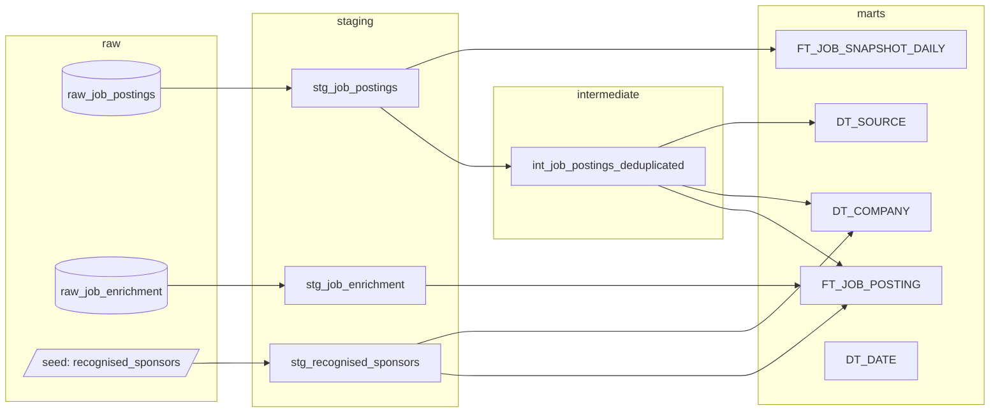

# Job Market Intelligence Engine

[](https://github.com/carlosdmv7/job-market-intelligence/actions/workflows/ci.yml)
[](https://github.com/carlosdmv7/job-market-intelligence/actions/workflows/pipeline.yml)

An end-to-end **data-engineering + analytics-engineering + LLM** project that
answers one question daily: **which open data roles across the EU match my
stack?**

It ingests postings from five free job APIs, has an LLM read each one for its
tech stack, seniority and working language, models the result dimensionally with
dbt, and serves it through a 7-page Streamlit app — with stack-overlap CV
scoring, a guard-railed natural-language **"Ask the Data"** agent, and a
classifier measured against a hand-labelled golden set rather than trusted.

Coverage is honest about itself: a posting the LLM has not read yet says so
everywhere, and a posting that has left its source board is marked closed rather
than shown as if you could still apply.

**Live app:** [job-market-intelligence-carlosdmv7.streamlit.app](https://job-market-intelligence-carlosdmv7.streamlit.app/) · **Runs at 0€** end to end (MotherDuck free tier,
Gemini/Ollama, free job APIs, GitHub Actions as the scheduler — see
[ADR 0005](docs/adr/0005-zero-cost-stack.md)).

[](https://job-market-intelligence-carlosdmv7.streamlit.app/)

<details>
<summary><b>More screens</b> — Market Trends, Ask the Data, How It Works, visa showcase</summary>

**Market Trends** — which countries hire, which stacks they ask for, and how both move across 60+ days of daily snapshots.


**Ask the Data** — natural language in, guard-railed read-only SQL out.


**How It Works** — the real prompt, live coverage, and the classifier's eval scores.


**Visa sponsorship (Netherlands)** — the auditable-data showcase: register match, KvK number, and the model's read side by side.


</details>

## The differentiating feature: signals you can audit, and coverage that admits its gaps

Most "AI job board" projects pipe postings through an LLM and present whatever
comes back as fact. Two disciplines here instead.

**Facts that can be looked up are never inferred.** Where a question has an
authoritative source, the project uses it and shows you the receipt; the LLM is
reserved for what only exists as prose. Visa sponsorship is the one field where
both are available for the same question, so it is the clearest demonstration —
and it is treated as a showcase, not as the product:

1. **Deterministic (primary):** every posting's company is cross-referenced
   against the official **IND register of recognised sponsors** — the ~12,800
   Dutch employers legally allowed to sponsor a highly-skilled-migrant visa
   ([scraper](scrapers/jmi_scrapers/ind_sponsors.py) → dbt seed →
   [normalized join](dbt/jmi/macros/jmi_normalize_company.sql) applied
   identically to both sides). A match is **auditable**: it carries the
   company's KvK (Chamber of Commerce) number, so every flag can be verified
   against a public register. No hallucinations possible.
2. **LLM (secondary):** the posting *text* is classified into a visa enum with
   confidence + verbatim evidence ([ADR 0003](docs/adr/0003-visa-enum-classification.md)),
   and that classifier is **measured against a hand-labelled golden set**
   ([ADR 0006](docs/adr/0006-llm-evaluation.md)) rather than trusted.

A posting the LLM has not read yet reads as **"not yet classified"** everywhere
in the app — never as "no sponsorship". Enrichment is quota-bound and
accumulates daily, so missing evidence is the normal state for most rows;
conflating it with negative evidence would break the one thing this tool is
for.

Measured on this corpus: **~3%** of companies on remote-first boards are
recognised sponsors against **~34%** on the Dutch local corpus — a gap a model
reading job text would never find, and one that holds for postings the LLM has
never seen.

**Absence is never reported as a finding.** Two failure modes the project
refuses: an unread posting shown as a negative result, and a filled role shown
as if you could still apply to it. Enrichment is capped by a free tier at a
measured 20 requests/day/model (batched 10 postings per request), so partial
coverage is the permanent normal state — every surface labels it. And because
boards delete filled roles instead of closing them, "days since we last saw it"
becomes an `is_active` flag, with closed roles kept for the trends and excluded
from the lists.

## The app: seven pages

| Page | What it answers |
|---|---|
| **Overview** | How many data roles are open right now, in which countries, for which stacks |
| **Find Jobs** | Every open posting as a filterable card: market, stack, seniority, parsed salary, working language |
| **My Fit** | Your CV against every open role — free stack-overlap ranking, then one LLM call on the posting you pick |
| **Market Trends** | Country comparison incl. how often English alone suffices, leading stacks day by day, 60+ days of snapshots |
| **Ask the Data** | Natural language in, guard-railed read-only SQL out, with the generated SQL always shown |
| **How It Works** | The pipeline diagram, the real system prompt, live coverage, and the classifier's eval scores |
| **Visa sponsorship (NL)** | The auditable-data showcase: IND register cross-reference, KvK receipts, per-posting evidence |

**My Fit** is deliberately two-tier, for the same reason the visa signal is:
spend nothing where determinism suffices, spend the LLM where it earns its cost.

1. **Free and instant** — the CV is intersected with the technology vocabulary
   the LLM *already* extracted from postings, and every enriched posting is
   ranked by skill overlap. No API call, works across the whole corpus.
2. **One call, on demand** — the posting you select plus the CV go to the
   provider for a match percentage, honest gaps, and concrete CV edits.

The CV lives in `st.session_state` only: never written to the warehouse, a
file, or the logs, and discarded when the tab closes. The single deep-dive
request is the only thing that ever leaves the session. Scoring logic is pure
functions in [`cv_match.py`](app/streamlit_app/cv_match.py) — no Streamlit, unit-tested.

## Architecture

```
5 job sources ──httpx──► ingest ─► raw.raw_job_postings (append-only)
IND sponsor register ──scraper──► dbt seed         raw.raw_job_enrichment  (LLM output)
                                        │
                    MotherDuck + dbt medallion: staging → intermediate → marts
                                        │
   Streamlit: Overview · Find Jobs · My Fit · Trends · Ask the Data · How It Works · Visa (NL)
```

**The 5 sources**, all `httpx`, all in [scrapers/](scrapers/jmi_scrapers):

| Source | Coverage | Key |
|---|---|---|
| `remotive` | Remote-first boards | none |
| `arbeitnow` | Remote-first boards, DE-leaning | none |
| `remoteok` | Remote-first boards | none |
| `jobtech` | Sweden (Platsbanken, public employment service) | none |
| `adzuna` | Per-country local corpora — NL, DE, ES | free key |

A sixth scraper, `honeypot`, is registered but **not verified** — its API is
unconfirmed, it is not in `DEFAULT_SOURCES`, and the daily pipeline does not
call it. It is a hook, not a source, and is excluded from every count here.

dbt lineage (rendered from the real DAG — 9 models, 1 seed, 49 data tests):


```mermaid
flowchart LR
    subgraph raw
        P[(raw_job_postings)]
        E[(raw_job_enrichment)]
        S[/seed: recognised_sponsors/]
    end
    subgraph staging
        SP[stg_job_postings]
        SE[stg_job_enrichment]
        SS[stg_recognised_sponsors]
    end
    subgraph intermediate
        DD[int_job_postings_deduplicated]
    end
    subgraph marts
        FT[FT_JOB_POSTING]
        SN[FT_JOB_SNAPSHOT_DAILY]
        DC[DT_COMPANY]
        DS[DT_SOURCE]
        DT[DT_DATE]
    end
    P --> SP --> DD
    E --> SE --> FT
    S --> SS --> FT
    SS --> DC
    DD --> FT
    DD --> DC
    DD --> DS
    SP --> SN
```

Grain table and full diagram: [docs/architecture.md](docs/architecture.md) ·
**[dbt docs — lineage & tests](https://carlosdmv7.github.io/job-market-intelligence/)**
(published from the real DAG on every merge to `main`).

## What runs every day

[`pipeline.yml`](.github/workflows/pipeline.yml) executes
`ingest → enrich → dbt build` every morning (07:15 Amsterdam). GitHub Actions
is the deliberate 0€ substitute for an always-on orchestration worker; the
flows carry Prefect `@flow` decorators, so they *would* report state and logs to
Prefect Cloud if `PREFECT_API_URL`/`PREFECT_API_KEY` were set. They are not set:
a hosted worker is not 0€, so the decorators are structure, not a live
deployment.
[`prefect.yaml`](orchestration/prefect.yaml) documents the worker-based
production path and why it is not deployed (it needs a paid always-on machine).

The daily cadence is also what feeds `FT_JOB_SNAPSHOT_DAILY`: posting
lifetimes and market trends accumulate one snapshot per day.

## Honest status: production-grade vs demo

| Piece | State |
|---|---|
| Contracts (Pydantic v2, `content_hash`, `SCHEMA_VERSION`) | Production-grade: versioned, hash-stable, 100% typed |
| IND sponsor cross-reference | Production-grade: deterministic, tested, auditable by KvK |
| dbt medallion (dedup grain, quality tests) | Production-grade: 49 data tests incl. grain + invariant tests |
| Ingestion breadth | Demo: 5 operational sources (3 remote boards + JobTech SE + Adzuna NL/DE/ES) — a fraction of the real market (LinkedIn/Indeed sit behind paid anti-bot) |
| LLM enrichment | Working, quota-bound: Gemini free tier caps daily throughput; coverage accumulates via the daily run |
| Orchestration | GitHub Actions cron (real, daily); Prefect deployments documented but not deployed — that would not be 0€ |
| Text-to-SQL agent | Guard-railed (SELECT-only, single statement, forced LIMIT, read-only connection) — not hardened against a hostile user |
| LLM evals | Harness production-grade (stratified sampler, replayed CI job, committed thresholds); the golden set is sampled but **labelling is in progress**, so no accuracy number is claimed yet |

## Repo layout (uv workspace monorepo)

| Path | What |
|---|---|
| [libs/jmi_core](libs/jmi_core) | Canonical Pydantic contracts, settings, logging, MotherDuck client |
| [scrapers](scrapers) | The 5 operational `httpx` scrapers + the IND sponsor register |
| [enrichment](enrichment) | Pluggable LLM providers (Ollama/Gemini/Anthropic), salary parser, dedup |
| [orchestration](orchestration) | Prefect-instrumented ingest + enrich flows, `prefect.yaml` |
| [dbt/jmi](dbt/jmi) | Medallion project: staging → int dedup → `FT_`/`DT_` marts + seed |
| [app](app) | Streamlit app (7 pages, top-nav) + text-to-SQL agent + the committed demo sample |
| [evals](evals) | Golden-set eval harness (sampler, replay, metrics); scores English-sufficiency, and visa on request |
| [infra](infra) | Docker Compose (Ollama + app), Dockerfiles |
| [docs](docs) | Architecture + ADRs |

## Quickstart

Run it with no credentials at all — the repo ships a committed sample of the
marts and the app falls back to it, saying so on every page:

```bash
uv sync --all-packages
make app                      # http://localhost:8501, demo mode, no secrets
```

For the real thing:

```bash
cp .env.example .env          # set motherduck_token (the only required secret)
uv sync --all-packages

make warehouse-init           # raw/staging/marts schemas in MotherDuck
make ingest-all               # free boards (incl. JobTech SE) -> raw
make ingest-nl                # Adzuna NL (needs free ADZUNA_APP_ID/KEY)
make ingest SOURCE=adzuna COUNTRY=de   # any Adzuna country (nl/es/de/fr/it/...)
make sponsors-refresh         # IND register -> dbt seed (monthly)
make enrich                   # LLM classification -> raw
make dbt-build                # staging -> marts (+ 49 data tests)
make evals                    # score the visa classifier (offline, replayed)
make app                      # Streamlit at http://localhost:8501
```

LLM default is Gemini free tier; fully-local Ollama and Anthropic are one env
var away (`JMI_LLM_PROVIDER`) — the classifier and the agent share the setting.

## Development

```bash
make check        # ruff + mypy (strict-ish) + pytest
```

Branch naming, Conventional Commits (enforced by a `commit-msg` hook), and the
PR flow: [CONTRIBUTING.md](CONTRIBUTING.md).

CI runs lint, type-check, tests, and `dbt parse` on every push. The unit suite
covers the contracts, scrapers, enrichment (incl. provider wiring), the
pipeline functions, and the SQL guard — all offline, no warehouse or LLM
needed.

## Key decisions (ADRs)

1. [Separate raw / enriched contracts](docs/adr/0001-canonical-schema-separation.md)
2. [Cross-source dedup in dbt](docs/adr/0002-cross-source-dedup-in-dbt.md)
3. [Visa as enum + confidence + evidence](docs/adr/0003-visa-enum-classification.md)
4. [MotherDuck + dbt medallion](docs/adr/0004-warehouse-motherduck-medallion.md)
5. [Zero-cost stack](docs/adr/0005-zero-cost-stack.md)
6. [The golden set is the classifier's contract](docs/adr/0006-llm-evaluation.md)

## Measuring the LLM, not just using it

The visa classifier is scored against a hand-labelled golden set of ~200
stratified postings ([`evals/`](evals)). CI replays **recorded** production
responses — no key, no quota, no network — so a red eval means the prompt or
the code changed, never that the model had a bad morning.

```bash
make evals-sample     # stratified, deterministic, additive
# label `visa_status_true` by hand
make evals-record     # harvest responses the pipeline already stored
make evals            # precision / recall / per-class F1 / confusion matrix
```

The ground truth answers *"does this posting's text state or imply
sponsorship?"* — never *"can this employer sponsor?"*, which the IND register
already answers deterministically. Agreement between the two signals is
reported as a **diagnostic, not a score**: a recognised sponsor whose ad never
mentions visas is the ordinary case, and the number worth watching is the
reverse — the LLM claiming sponsorship at an employer that legally cannot
sponsor. Why the golden set is the contract:
[ADR 0006](docs/adr/0006-llm-evaluation.md).

## Tech stack

Python 3.11 · Pydantic v2 · DuckDB/MotherDuck · dbt · Prefect · httpx ·
Gemini/Ollama · Streamlit · Altair · uv · ruff · mypy · pytest · GitHub Actions.

## License

[MIT](LICENSE).
