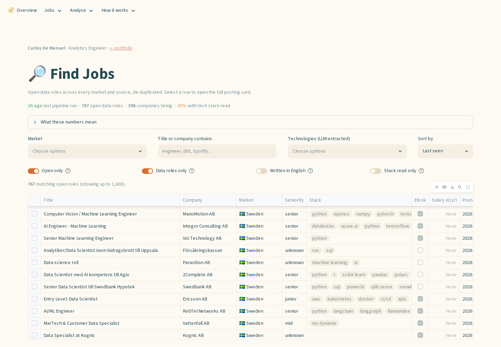
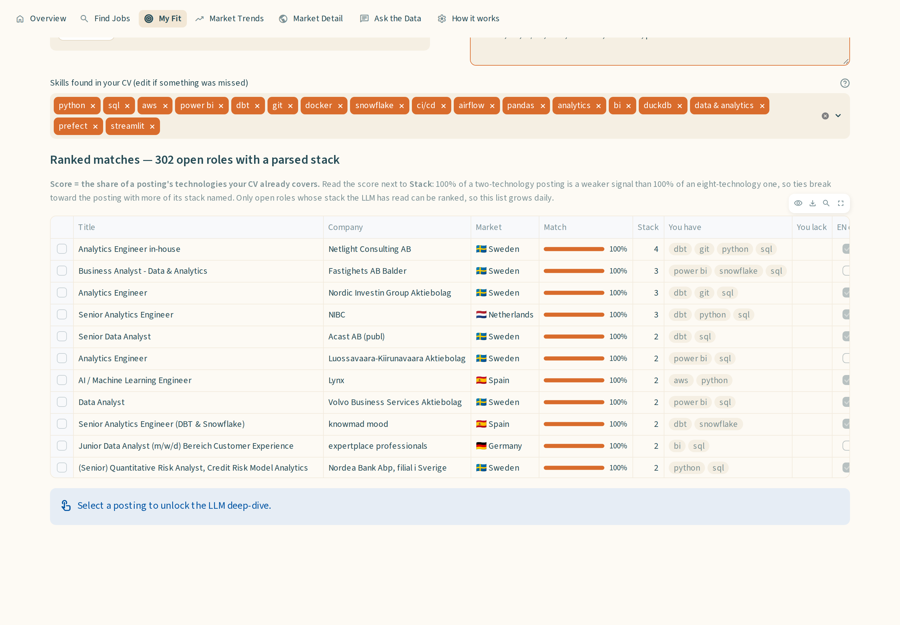
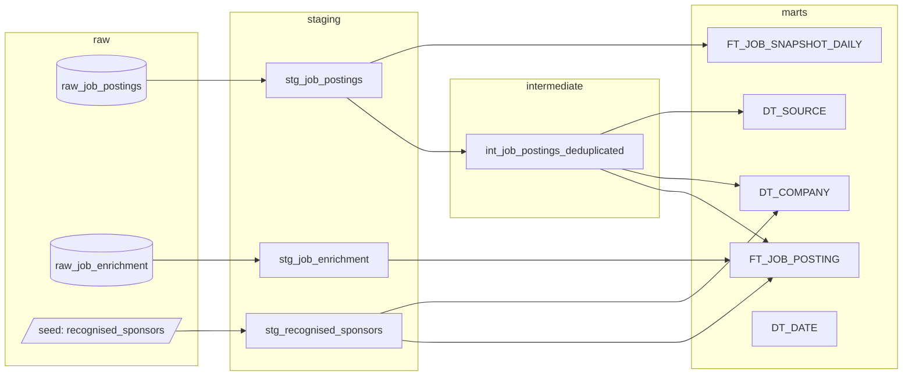

# Job Market Intelligence Engine

[](https://github.com/carlosdmv7/job-market-intelligence/actions/workflows/ci.yml)
[](https://github.com/carlosdmv7/job-market-intelligence/actions/workflows/pipeline.yml)

An end-to-end **data-engineering + analytics-engineering + LLM** project that
answers one question every morning: **which open data roles in the EU are asking
for my stack?**

It ingests postings from five free job APIs, has an LLM read each one for the
technologies it names, its seniority and its working language, models the result
dimensionally with dbt, and serves it through a seven-page Streamlit app — with
stack-overlap CV scoring, a guard-railed natural-language **"Ask the Data"**
agent, and a classifier that is measured against a hand-labelled golden set
rather than trusted.

Two rules run through all of it: **a posting the LLM has not read yet says so**
everywhere instead of being reported as a negative finding, and **a posting that
has left its board is marked closed** instead of being offered as if you could
still apply.

**Live app:** [job-market-intelligence-carlosdmv7.streamlit.app](https://job-market-intelligence-carlosdmv7.streamlit.app/) · **Runs at 0€** end to end (MotherDuck free tier,
Gemini free tier, free job APIs, GitHub Actions as the scheduler — see
[ADR 0005](docs/adr/0005-zero-cost-stack.md) and [ADR 0008](docs/adr/0008-gemini-is-the-default-provider.md)).

[](https://job-market-intelligence-carlosdmv7.streamlit.app/)

<details>
<summary><b>More screens</b> — Find Jobs, My Fit, Market Trends, Ask the Data, How It Works, the visa showcase</summary>

**Find Jobs** — every open posting as a filterable row; select one for the full card, which leads with the stack, the seniority and whether English alone is enough.



**My Fit** — your CV against every open role, free and instant: the share of each posting's stack you already cover, what you have, what you lack.



**Market Trends** — which countries hire, how often their ads are written in English, which stacks they ask for, and how all of it moves across 60+ days of daily snapshots.


**Ask the Data** — natural language in, guard-railed read-only SQL out, always shown before it runs.


**How It Works** — the pipeline diagram, live coverage, the real system prompt, and the classifier's eval scores.


**Visa sponsorship (Netherlands)** — the auditable-data showcase: register match, KvK number, and the model's read side by side.


</details>

## The differentiating feature: signals you can audit, and coverage that admits its gaps

Most "AI job board" projects pipe postings through an LLM and present whatever
comes back as fact. Three disciplines here instead.

### 1. Absence is never reported as a finding

Enrichment is capped by a free tier at a measured **20 requests/day/model**, so
partial coverage is the permanent normal state. Every surface labels it: a
posting the LLM has not read reads as **"not yet classified"**, never as "no
match". Conflating the two would break the one thing the tool is for.

The quota is counted in *requests*, not tokens, so ten postings ride in each
one — the same free budget reads **200 postings a day instead of 20**. Each
response echoes the index of the posting it answers and is matched by that
index, never by position: a short or reordered reply would otherwise attach one
job's stack to another, silently and undetectably.

### 2. A filled role is not an open one

Job boards delete filled roles rather than closing them, so "days since we last
saw it" is the only liveness signal available. It becomes an `is_active` flag,
measured against the corpus's **newest observation** rather than
`current_date` — so a stalled pipeline cannot mark the whole market closed on a
calendar technicality. Closed roles are kept for the trends and excluded from
every list. Before this existed, 1,331 of 2,755 data roles had not been seen in
three weeks and were being presented as current.

### 3. Facts that can be looked up are never inferred

Where a question has an authoritative source, the project uses it and shows the
receipt; the LLM is reserved for what only exists as prose. **Visa sponsorship
is the one field where both are available for the same question**, which makes
it the clearest demonstration — and it is treated as a showcase, not as the
product ([ADR 0007](docs/adr/0007-fit-first-and-batched-enrichment.md)):

1. **Deterministic (primary):** every company is cross-referenced against the
   official **IND register of recognised sponsors** — the ~12,800 Dutch
   employers legally allowed to sponsor a highly-skilled-migrant visa
   ([scraper](scrapers/jmi_scrapers/ind_sponsors.py) → dbt seed →
   [normalized join](dbt/jmi/macros/jmi_normalize_company.sql) applied
   identically to both sides). A match carries the company's KvK number, so
   every flag is verifiable against a public register. No hallucinations
   possible.
2. **LLM (secondary):** the posting *text* is classified into a visa enum with
   confidence + verbatim evidence ([ADR 0003](docs/adr/0003-visa-enum-classification.md)),
   and that classifier is **measured against a hand-labelled golden set**
   ([ADR 0006](docs/adr/0006-llm-evaluation.md)) rather than trusted.

Measured on this corpus: **~3%** of companies on remote-first boards are
recognised sponsors against **~34%** on the Dutch local corpus — a gap a model
reading job text would never find, and one that holds for postings the LLM has
never seen.

**Why the visa feature is a showcase and not the headline.** It was the original
flagship. The measurement retired it: across 730 enriched postings the
classifier's own output was `unclear` 583 times and `explicit_yes` **once**. A
class that rare cannot be scored — and the person using the tool is an EU
citizen who never needs sponsorship. The feature is kept because it is the most
auditable component in the repo; it is simply not what the app is *for*. The
full reasoning, with the numbers, is in ADR 0007.

## The app: seven pages

| Page | What it answers |
|---|---|
| **Overview** | How many data roles are open right now, in which countries, for which stacks |
| **Find Jobs** | Every open posting as a filterable row — market, stack, seniority, salary, working language — and a card that leads with fit |
| **My Fit** | Your CV against every open role: free stack-overlap ranking, then one LLM call on the posting you pick |
| **Market Trends** | Country comparison incl. how often the ads are written in English, leading stacks day by day, 60+ days of snapshots |
| **Ask the Data** | Natural language in, guard-railed read-only SQL out, with the generated SQL always shown |
| **How It Works** | The pipeline diagram, live coverage, the real system prompt, the classifier's eval scores |
| **Visa signal (NL)** | The auditable-data showcase: IND register cross-reference, KvK receipts, per-posting evidence |

**My Fit** is deliberately two-tier, for the same reason the visa signal is:
spend nothing where determinism suffices, spend the LLM where it earns its cost.

1. **Free and instant** — the CV is intersected with the technology vocabulary
   the LLM *already* extracted from postings, and every enriched posting is
   ranked by the share of its stack you cover. No API call, whole corpus.
2. **One call, on demand** — the posting you select plus the CV go to the
   provider for a match percentage, honest gaps, and concrete CV edits.

The CV lives in `st.session_state` only: never written to the warehouse, a
file, or the logs, and discarded when the tab closes. The single deep-dive
request is the only thing that ever leaves the session. Scoring logic is pure
functions in [`cv_match.py`](app/streamlit_app/cv_match.py) — no Streamlit,
unit-tested.

## Architecture

```
5 job sources ──httpx──► ingest ─► raw.raw_job_postings (append-only)
IND sponsor register ──scraper──► dbt seed         raw.raw_job_enrichment  (LLM output)
                                        │
                    MotherDuck + dbt medallion: staging → intermediate → marts
                                        │
   Streamlit: Overview · Find Jobs · My Fit · Trends · Ask the Data · How It Works · Visa (NL)
```

**The 5 sources**, all `httpx`, all in [scrapers/](scrapers/jmi_scrapers):

| Source | Coverage | Key |
|---|---|---|
| `remotive` | Remote-first boards | none |
| `arbeitnow` | Remote-first boards, DE-leaning | none |
| `remoteok` | Remote-first boards | none |
| `jobtech` | Sweden (Platsbanken, public employment service) | none |
| `adzuna` | Per-country local corpora — NL, DE, ES | free key |

A sixth scraper, `honeypot`, is registered but **not verified** — its API is
unconfirmed, it is not in `DEFAULT_SOURCES`, and the daily pipeline does not
call it. It is a hook, not a source, and is excluded from every count here.

dbt lineage (rendered from the real DAG — 9 models, 1 seed, 53 data tests):


```mermaid
flowchart LR
    subgraph raw
        P[(raw_job_postings)]
        E[(raw_job_enrichment)]
        S[/seed: recognised_sponsors/]
    end
    subgraph staging
        SP[stg_job_postings]
        SE[stg_job_enrichment]
        SS[stg_recognised_sponsors]
    end
    subgraph intermediate
        DD[int_job_postings_deduplicated]
    end
    subgraph marts
        FT[FT_JOB_POSTING]
        SN[FT_JOB_SNAPSHOT_DAILY]
        DC[DT_COMPANY]
        DS[DT_SOURCE]
        DT[DT_DATE]
    end
    P --> SP --> DD
    E --> SE --> FT
    S --> SS --> FT
    SS --> DC
    DD --> FT
    DD --> DC
    DD --> DS
    SP --> SN
```

Grain table and full diagram: [docs/architecture.md](docs/architecture.md) ·
**[dbt docs — lineage & tests](https://carlosdmv7.github.io/job-market-intelligence/)**
(published from the real DAG on every merge to `main`).

## What runs every day

[`pipeline.yml`](.github/workflows/pipeline.yml) executes
`ingest → enrich → dbt build` every morning (07:15 Amsterdam). GitHub Actions
is the deliberate 0€ substitute for an always-on orchestration worker; the
flows carry Prefect `@flow` decorators, so they *would* report state and logs to
Prefect Cloud if `PREFECT_API_URL`/`PREFECT_API_KEY` were set. They are not set:
a hosted worker is not 0€, so the decorators are structure, not a live
deployment. [`prefect.yaml`](orchestration/prefect.yaml) documents the
worker-based production path and why it is not deployed.

The run summary is appended to `meta.pipeline_run` **in the warehouse**, not to
a committed file — the app reads its freshness strip from there. The earlier
design distilled it into a JSON file, which meant two bot commits to `main`
every single day, 58 of them in the first month, burying the human history.

The daily cadence is also what feeds `FT_JOB_SNAPSHOT_DAILY`: posting lifetimes
and market trends accumulate one snapshot per day.

## Honest status: production-grade vs demo

| Piece | State |
|---|---|
| Contracts (Pydantic v2, `content_hash`, `SCHEMA_VERSION`) | Production-grade: versioned, hash-stable, 100% typed |
| IND sponsor cross-reference | Production-grade: deterministic, tested, auditable by KvK |
| dbt medallion (dedup grain, quality tests) | Production-grade: 53 data tests incl. grain, invariant and liveness tests |
| Ingestion breadth | Demo: 5 operational sources (3 remote boards + JobTech SE + Adzuna NL/DE/ES) — a fraction of the real market (LinkedIn/Indeed sit behind paid anti-bot) |
| LLM enrichment | Working, quota-bound: the Gemini free tier caps daily throughput at ~200 postings; coverage accumulates via the daily run |
| Orchestration | GitHub Actions cron (real, daily); Prefect deployments documented but not deployed — that would not be 0€ |
| Text-to-SQL agent | Guard-railed (SELECT-only, single statement, forced LIMIT, and a read-only connection MotherDuck enforces server-side) — not hardened against a hostile user |
| LLM evals | Harness production-grade (stratified sampler, replayed CI job, committed thresholds). 22 postings hand-labelled for the visa target — the measurement that retired that feature. **No headline accuracy is claimed** and none is planned: the question the app depends on is cross-checked against a deterministic signal at 100% coverage instead ([ADR 0010](docs/adr/0010-cross-check-instead-of-hand-labels.md)) |
| Containerisation | None. There was Docker Compose scaffolding; it could not be built or run here, so it was deleted rather than left as an untested claim ([ADR 0008](docs/adr/0008-gemini-is-the-default-provider.md)) |

## Repo layout (uv workspace monorepo)

| Path | What |
|---|---|
| [libs/jmi_core](libs/jmi_core) | Canonical Pydantic contracts, settings, logging, MotherDuck client, the data-role vocabulary |
| [scrapers](scrapers) | The 5 operational `httpx` scrapers + the IND sponsor register |
| [enrichment](enrichment) | Pluggable LLM providers (Gemini/Ollama/Anthropic), batched classifier, salary parser, dedup |
| [orchestration](orchestration) | Prefect-instrumented ingest + enrich flows, `prefect.yaml` |
| [dbt/jmi](dbt/jmi) | Medallion project: staging → int dedup → `FT_`/`DT_` marts + seed |
| [app](app) | Streamlit app (7 pages, top-nav) + text-to-SQL agent + the committed demo sample |
| [evals](evals) | Golden-set eval harness (sampler, replay, metrics); scores English-sufficiency, and visa on request |
| [docs](docs) | Architecture + 10 ADRs |

## Quickstart

Run it with no credentials at all — the repo ships a committed sample of the
marts and the app falls back to it, saying so on every page:

```bash
uv sync --all-packages
make app                      # http://localhost:8501, demo mode, no secrets
```

For the real thing:

```bash
cp .env.example .env          # motherduck_token is the only required secret
uv sync --all-packages

make warehouse-init           # raw/staging/marts schemas in MotherDuck
make ingest-all               # free boards (incl. JobTech SE) -> raw
make ingest-nl                # Adzuna NL (needs free ADZUNA_APP_ID/KEY)
make ingest SOURCE=adzuna COUNTRY=de   # any Adzuna country (nl/es/de/fr/it/...)
make sponsors-refresh         # IND register -> dbt seed (monthly)
make enrich                   # LLM classification -> raw
make dbt-build                # staging -> marts (+ 53 data tests)
make evals                    # score the classifier (offline, replayed)
make app                      # Streamlit at http://localhost:8501
```

The LLM default is the Gemini free tier — the only provider that runs on a
laptop, a GitHub runner *and* Streamlit Community Cloud. Fully-local Ollama and
Anthropic are one env var away (`JMI_LLM_PROVIDER`); the classifier and the
agent share the setting.

**Deploying the app** with live data needs no code change and no committed
secret: on Streamlit Community Cloud, put `motherduck_token` and
`JMI_DUCKDB_DATABASE` in the app's **Secrets** panel, which lives in that
dashboard and never touches the repo. Without either, the app serves the
committed sample and says so.

The token is a **read/write** one, because MotherDuck's free plan issues no
other kind — so the app's safety deliberately does not rest on it. The
connection is opened `read_only=True` and **MotherDuck enforces that
server-side**: a write over a read-only attachment is refused by the server, not
by a check in this code. There is no fallback to a writable connection; if
read-only cannot be opened the app drops to the committed sample rather than
quietly acquiring write access ([ADR 0009](docs/adr/0009-read-only-by-connection-not-by-token.md)).

## Development

```bash
make check        # ruff + mypy (strict-ish) + pytest
```

Branch naming, Conventional Commits (enforced by a `commit-msg` hook), and the
PR flow: [CONTRIBUTING.md](CONTRIBUTING.md).

CI runs lint, type-check, tests, and `dbt parse` on every push. The unit suite
covers the contracts, scrapers, enrichment (incl. provider wiring and batch
index matching), the pipeline functions, the display helpers and the SQL guard —
all offline, no warehouse or LLM needed.

## Key decisions (ADRs)

1. [Separate raw / enriched contracts](docs/adr/0001-canonical-schema-separation.md)
2. [Cross-source dedup in dbt](docs/adr/0002-cross-source-dedup-in-dbt.md)
3. [Visa as enum + confidence + evidence](docs/adr/0003-visa-enum-classification.md)
4. [MotherDuck + dbt medallion](docs/adr/0004-warehouse-motherduck-medallion.md)
5. [Zero-cost stack](docs/adr/0005-zero-cost-stack.md)
6. [The golden set is the classifier's contract](docs/adr/0006-llm-evaluation.md)
7. [Stack fit is the product; visa is a showcase — and batching the enrichment](docs/adr/0007-fit-first-and-batched-enrichment.md)
8. [Gemini is the default provider; the container scaffolding is gone](docs/adr/0008-gemini-is-the-default-provider.md)
9. [The app is read-only by connection, not by token](docs/adr/0009-read-only-by-connection-not-by-token.md)
10. [Cross-check against a deterministic signal instead of hand labels](docs/adr/0010-cross-check-instead-of-hand-labels.md)

## Measuring the LLM, not just using it

The classifier is scored against a hand-labelled golden set of ~200 stratified
postings ([`evals/`](evals)). CI replays **recorded** production responses — no
key, no quota, no network — so a red eval means the prompt or the code changed,
never that the model had a bad morning.

```bash
make evals-sample                # stratified, deterministic, additive
make evals-label TARGET=visa     # label by hand, keys 1-5
make evals-record                # harvest responses the pipeline already stored
make evals TARGET=visa           # precision / recall / per-class F1 / confusion
```

The target is a parameter, because the field worth measuring changed when the
product did. `--target visa` still scores the 22 visa labels already made; those
numbers are what retired that feature and they stay in the repo as the record.

**The English target is deliberately left unlabelled.** Hand labels are the
expensive instrument, so they are spent only on questions a cheaper one cannot
reach — and this question has a cheaper one. The language an ad is *written* in
is detected deterministically on ingest, the classifier never sees it, and the
two line up sharply enough to act on:

| Ad written in | Postings read | Model says "English is enough" |
|---|---|---|
| English | 643 | 85% |
| Dutch | 255 | **0.4%** (1 posting) |
| Swedish | 72 | 10% |
| German | 64 | 9% |

That separation is evidence the model is reading rather than pattern-matching on
job titles — and it is also why the app's language filter runs on the detected
language, which is present on **100%** of postings, rather than on the model's
read, which is present on the share the quota has reached. Scoring a field
nothing filters by would buy a number, not a better tool
([ADR 0010](docs/adr/0010-cross-check-instead-of-hand-labels.md)).

The ground truth answers what the posting's **text** says, never what the
employer can legally do; that second question the IND register already answers
deterministically. Agreement between the two signals is reported as a
**diagnostic, not a score**: a recognised sponsor whose ad never mentions visas
is the ordinary case, and the number worth watching is the reverse — the LLM
claiming sponsorship at an employer that legally cannot sponsor. Why the golden
set is the contract: [ADR 0006](docs/adr/0006-llm-evaluation.md).

## Tech stack

Python 3.11 · Pydantic v2 · DuckDB/MotherDuck · dbt · Prefect · httpx ·
Gemini/Ollama · Streamlit · Altair · uv · ruff · mypy · pytest · GitHub Actions.

## License

[MIT](LICENSE).
